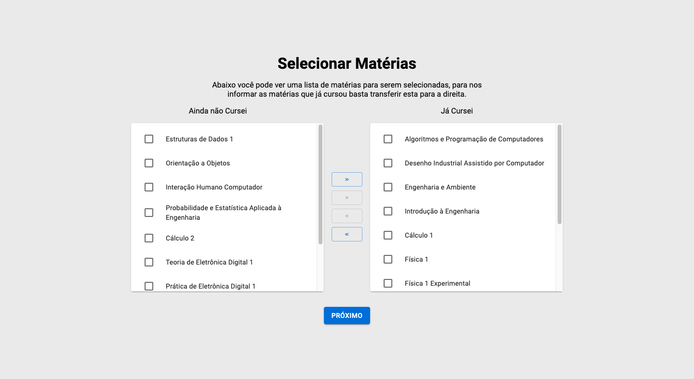
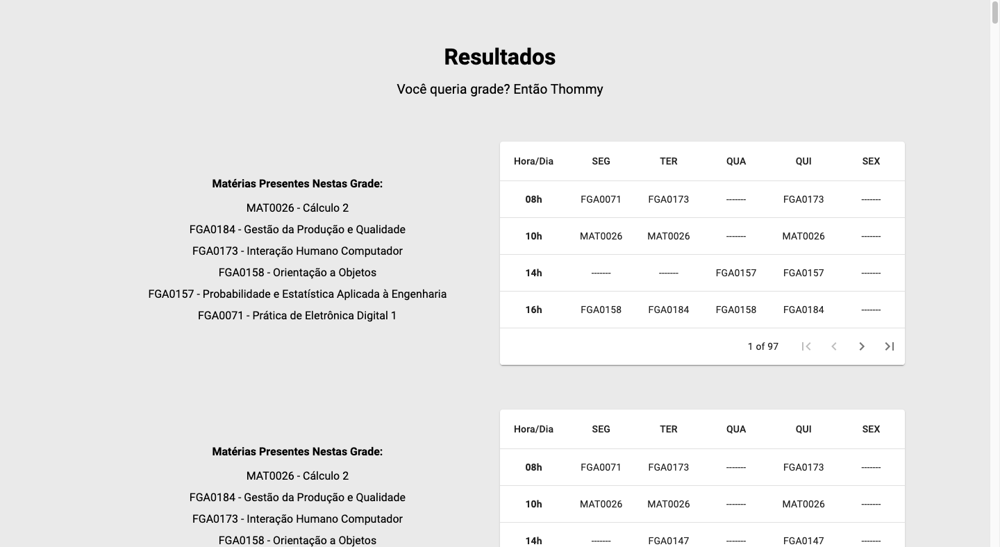

# Projeto Final - Thommy Grade

**Conteúdo da Disciplina**: Projeto Final<br>

## Alunos
| Matrícula | Aluno |
| :-: | :-: |
| 18/0030345  |  Arthur Sena |
| 18/0033646  |  João Luis Baraky |

## Sobre 
O Thommy Grade é um gerador de grades ideais para alunos da Engenharia de Software da FGA. A partir das matérias nas quais o usuário possui interesse e no máximo de créditos que ele deseja cursar, apresentamos todas as grades ótimas possíveis.

Você quer grade? Então thommy!!!!

## Screenshots





## Instalação 
**Linguagem**: JavaScript<br>
**Framework**: React<br>
É necessário possuir o node instalado na máquina

## Uso 
```powershell
# Clone o repositório

git clone https://github.com/projeto-de-algoritmos/Final_ThommyGrade

# Entre no diretório e instale as dependencias
cd Final_ThommyGrade && npm install

# Inicie o projeto
npm start
```

Após rodar o projeto visite a porta 3000 no seu navegador,
dentro dela você encontrará uma página informativa sobre 
como prosseguir.

## Limitações 

Retiramos dos CSVs as matérias que possuem horários a noite e/ou aos sábados. A aplicação também não aceita matérias que possuem apenas 1 hora de duração ou que acontecem durante os horários de 12 a 14 hrs. Essas limitação é devido a restrição do número de colunas da matriz resultante do Knapsack que atualmente está em 2^20 (**1048576**) colunas.

Adicionando o sábado: 2^24 (**16777216**) colunas <br>
Adicionando horários da noite: 2^36 (**68719476736**) colunas <br>
Atendendo matérias com 1 hora de duração: 2^72 (**4722366482869645213696**) colunas <br>
Atendendo tomas as possibilidades de encaixe: 2^90 (**1237940039285380274899124224**) colunas <br>

Apesar dessas restrições, a aplicação atende quase todas as turmas das matérias de Engenharia de Software, menos: Testes de Software (turma A) , TCC 1, TCC 2 e Estágio Supervisionado.
